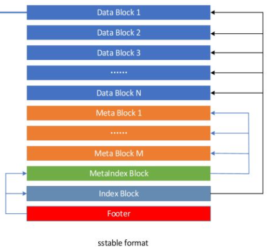

# Table

- [1. Block](#1-block)
  - [Block存储格式总览](#block存储格式总览)
  - [block data 的结构](#block-data-的结构)
- [2. File & SSTable Format](#2-file--sstable-format)
  - [2.2. 结构总览](#22-结构总览)
  - [2.3. Footer](#23-footer)
  - [2.4. Meta Block](#24-meta-block)
    - [2.4.1. "filter" Meta Block](#241-filter-meta-block)
    - [2.4.2. "stats" Meta Block](#242-stats-meta-block)
  - [2.5. Data block](#25-data-block)

> 参考：
> Github doc： <https://github.com/google/leveldb/blob/master/doc/table_format.md>
> 庖丁解LevelDB之数据存储：<http://catkang.github.io/2017/01/17/leveldb-data.html>
> LevelDB源码分析之十二：block：<https://blog.csdn.net/caoshangpa/article/details/78977743>
> LevelDB源码分析之十三：table：<https://blog.csdn.net/caoshangpa/article/details/79021568>

## 1. Block

### Block存储格式总览

Block的种类很多，包括Data Block、Meta Block等，每个Block由三部分组成，如下图所示：


1. **block data**
    block data是具体的KV对存储区域。虽然Block有好几种，但是block data都是有序的KV对，因此写入、读取block data的接口都是统一的。
2. **type**
    type指明使用的是哪种压缩方式，当前支持none和snappy压缩。
3. **crc32**
    数据校验位

LevelDB对block data的管理是读写分离的，读取后的遍历查询操作由Block类实现，block data的构建则由BlockBuilder类实现。

### block data 的结构


Block中每条数据Entry是以Key-Value方式存储的，并且是按Key有序存储，Leveldb很巧妙了利用了有序数组相邻Key可能有**相同的Prefix**的特点来减少存储数据量。如上图所示，每个Entry只记录自己的Key与前一个Entry Key的不同部分，例如要顺序存储Key值“apple”和“applepen”的两条数据，这里第二个Entry中只需要存储“pen”的信息。

Entry解释如下:

| 数据项         | 类型                 | 含义                 |
| -------------- | -------------------- | -------------------- |
| shared_bytes   | varint32             | 共享前缀长度         |
| unshared_bytes | varint32             | 前缀之后的字符串长度 |
| value_length   | varint32             | 值的长度             |
| key_delta      | char[unshared_bytes] | 前缀之后的字符串     |
| value          | char[value_length]   | 值                   |

通过这些长度信息和其后相邻的特有Key及Value内容，结合前一条Entry的Key内容，我们可以方便的获得当前Entry的完整Key和Value信息。

这种方式非常好的减少了数据存储，但同时也引入一个**风险**，如果最开头的Entry数据损坏，其后的所有Entry都将无法恢复。为了降低这个风险，leveldb引入了**重启点**，每隔固定条数Entry会强制加入一个重启点，这个位置的Entry会完整的记录自己的Key，并将其shared值设置为0。同时，**Block会将这些重启点的偏移量及个数记录在所有Entry后边的Tailer中**。


block data的结尾段格式是：

- restarts:      uint32[num_restarts]
- num_restarts:  uint32

尾段存储的是重启点相关信息，包括重启点的位置和个数。元素restarts[i]存储的是block data第i个重启点距离block data首地址的偏移。很明显第一条记录，总是第一个重启点，也就是restarts[0] = 0。num_restarts是重启点的个数。


## 2. File & SSTable Format

### 2.2. 结构总览

```cpp
<beginning_of_file>
[data block 1]
[data block 2]
...
[data block N]
[meta block 1]
...
[meta block K]
[metaindex block]
[index block]
[Footer]        (fixed size; starts at file_size - sizeo(Footer))
<end_of_file>
```



解释如下：

- Data blocks： 一系列排序的Key/Value对, 该内容处于文件的开头，并根据选择进行压缩。
- Meta blocks：目前是bloom filter，可以加不同类型的过滤器，该部分内容也是可选择地压缩。
- MetaIndex block：只有一个，它每隔一个Meta block包含一个条目，其中Key是meta块的名称，Value是指向该meta块的BlockHandle。
- Index block：只有一个，每隔一个Data block包含一个条目，其中Key是一个字符串，它大于等于该Data block最后一个Key，且小于紧跟后面一个Data block的第一个Key（即是分界Key）。值是Data block的BlockHandle。
- Footer：处于文件的最后，包含MetaIndex block和Index block的BlockHandle以及一个magic numbe。

### 2.3. Footer

Footer是SST文件解析开始的地方，通过Footer中记录的这两个关键元信息Block的位置，可以方便的开启之后的解析工作。

Footer的内容如下：

```cpp
    metaindex_handle: char[p];     // Block handle for metaindex
    index_handle:     char[q];     // Block handle for index
    padding:          char[40-p-q];// zeroed bytes to make fixed length
                                   // (40==2*BlockHandle::kMaxEncodedLength)
    magic:            fixed64;     // == 0xdb4775248b80fb57 (little-endian)
```

代码实现中Footer有48字节：

- Index Block --------------------------- 16 bytes
- MetaIndex Block ----------------------- 16 bytes
- Padding填充 --------------------------- 8 bytes
- magic number（标识SSTable是否合法）---- 8 bytes

### 2.4. Meta Block

#### 2.4.1. "filter" Meta Block

如果在打开数据库时指定了`FilterPolicy`，一个filter 块将存储在每个表中(即Meta block为Filter block)。 此时，MetaIndex Block 块包含一个条目，该条目从filter.\<N\>映射到filter block的BlockHandle，其中\<N\>是过滤器策略的Name（）方法返回的字符串。

Filter block存储一系列filters，其中`filter i`包含`FilterPolicy::CreateFilter()`对特定范围所有Key产生的输出，这些key都存储在同一个块（data block）中，且这个块在file中的偏移为：

```cpp
[ i*base ... (i+1)*base-1 ]
```

目前，base为2KB。

例如，Block X和Block Y的起始偏移在范围 [ 0KB .. 2KB-1 ]内，则这两个块中所有的的key都会通过调用`FilterPolicy::CreateFilter()`转化到同一个filter中，且这个filter的编号为0（即第一个）。

```cpp
[filter 0]
[filter 1]
[filter 2]
...
[filter N-1]

[offset of filter 0]                  : 4 bytes
[offset of filter 1]                  : 4 bytes
[offset of filter 2]                  : 4 bytes
...
[offset of filter N-1]                : 4 bytes

[offset of beginning of offset array] : 4 bytes
lg(base)                              : 1 byte
```

#### 2.4.2. "stats" Meta Block

此时， meta block包含一系列统计信息，Key是统计信息的名称，Value包含统计信息。

记录下列信息：

```cpp
data size
index size
key size (uncompressed)
value size (uncompressed)
number of entries
number of data blocks
```

### 2.5. Data block

以Key-Value的方式存储实际数据，其中Key定义为：

```cpp
DataBlock Key := UserKey + SequenceNum + Type
Type := kDelete or kValue
```

对比Memtable中的Key，可以发现Data Block中的Key并没有拼接UserKey的长度在UserKey前，这是由于上面讲到的物理结构中已经有了Key的长度信息。

