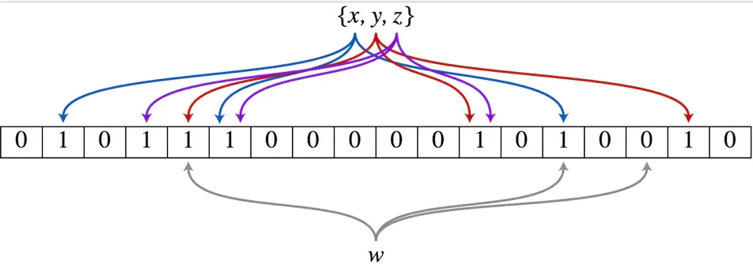

# Bloom Filter简介

> 布隆过滤器(Bloom Filter)的原理和实现: <https://www.jianshu.com/p/88c6ac4b38c8>
>
> BLOOM FILTER —读数学之美: <https://blog.csdn.net/gls_jia/article/details/6778077
>
> Bloom Filter概念和原理：<https://blog.csdn.net/jiaomeng/article/details/1495500>

## 应用场景

判断一个元素是否在一个(大)集合中：

- 字处理软件中，需要检查一个英语单词是否拼写正确
- 在 FBI，一个嫌疑人的名字是否已经在嫌疑名单上
- 在网络爬虫里，一个网址是否被访问过
- yahoo, gmail等邮箱垃圾邮件过滤功能

> 对于识别误伤，可以使用白名单作为补充

## 传统解决方案的弊端

通常的做法有如下几种思路：

- 数组
- 链表
- 树、平衡二叉树、Trie
- Map (红黑树)
- 哈希表

这些数据结构适合数据量不大的情况，当数据量大时，内存消耗量太大。如：

- 数组、链表、树等数据结构会存储元素的内容，内存呈现线性增长，最终达到瓶颈。
- 哈希表查询效率可以达到O(1)。但是哈希表需要消耗的内存依然很高，哈希表存储效率通常小于50%（哈希冲突）。

Bloom filter只需要哈希表1/8 到 1/4 的大小就能解决同样的问题，但是会有一定的误识别率，可以设置白名单。

## Bloom Filter介绍

- 巴顿.布隆于一九七零年提出
- 一个很长的二进制向量 （位数组）
- 一系列随机函数 (哈希)
- 空间效率和查询效率高
- 不会漏判，但是有一定的误判率（哈希表是精确匹配）

## Bloom Filter的原理

布隆过滤器（Bloom Filter）的核心实现是：

- 一个超大的位数组
- 几个哈希函数。

假设位数组的长度为m，哈希函数的个数为k。一个哈希函数将元素映射到数组的一个位置，k个函数则映射到k个位置。

以上图为例，假设集合里面有3个元素{x, y, z}，哈希函数的个数为3。

- 初始化：bit数组初始化为0
- 映射：将每个元素通过3个哈希函数映射到的三个位置置为1
- 查询：比如查询元素w，使用同样的三个哈希函数对w进行映射，如果对应到数组的三个位置均为1，则判断该元素可能存在于集合中。否则，可以判断该元素一定不存在于集合中。
- 存在误判

对于误判率的计算可以参考：[Bloom Filter概念和原理](https://blog.csdn.net/jiaomeng/article/details/1495500)

