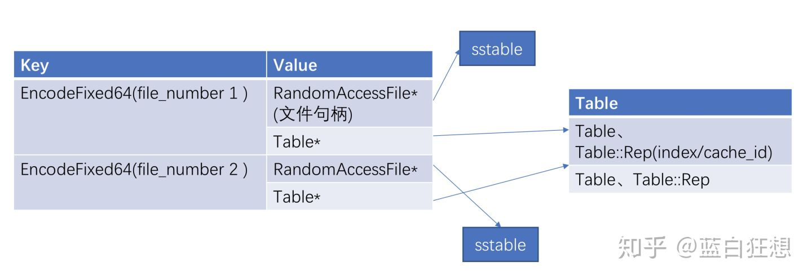

# Cache

- [1. Table cache](#1-table-cache)
- [2. Block cache](#2-block-cache)
- [3. 数据结构概况](#3-数据结构概况)

> 参考：
>
> - LevelDB源码分析之十一：cache： <https://blog.csdn.net/caoshangpa/article/details/78960999>
> - LevelDb 源码阅读--Cache： <https://zhuanlan.zhihu.com/p/85064874>

为了加快查找速度，LevelDB在内存中采用Cache的方式，在table中采用bloom filter的方式，尽最大可能加快随机读操作。LevelDB的Cache分为两种，分别是table cache和block cache。**Block Cache是配置可选的**，即可以在配置文件中指定是否打开这个功能。

## 1. Table cache

Table cache缓存的是table的索引数据（data block index），类似于文件系统中对inode的缓存。table cache的大小由options.max_open_files确定，表示可以缓存max_open_files个table文件的索引信息。

- table cache默认大小是1000
- 其最小值为20 - 10
- 最大值为50000 - 10

Table Cache是基于ShardedLRUCache实现。key-value如下：



- key值是SSTable的文件名称（实际是文件编号，编号加后缀名就是文件名）
- Value部分包含两部分：
  - RandomAccessFile*: 指向磁盘打开的SSTable文件的文件指针。
  - Table*: 是指向内存中这个SSTable文件对应的Table结构指针，table结构在内存中，保存了SSTable的index内容以及用来指示block cache用的cache_id。

## 2. Block cache

block cache是缓存的block数据（data block），block是table文件内组织数据的单位，也是从持久化存储中读取和写入的单位。由于table是按照key有序分布的，因此一个block内的数据也是按照key紧邻排布的（有序依照使用者传入的比较函数，默认按照字典序），类似于Linux中的page cache。

> block默认大小为4k，由LevelDB调用open函数打开数据库时时传入的options.block_size参数指定。LevelDB的代码中限制的block最小大小为1k，最大大小为4M。对于频繁做scan操作的应用，可适当调大此参数，对大量小value随机读取的应用，也可尝试调小该参数。

block cache默认实现是一个8M大小的ShardedLRUCache，此参数由options.block_cache设定。当然也可根据应用需求，提供自定义的缓存策略。注意，此处的大小是未压缩的block大小。

Block cache也是基于ShardedLRUCache，但它的实例处于Table结构体中：

```cpp
Cache* block_cache = table->rep_->options.block_cache;
```

它的key-value如下：

- key：文件的cache_id + 这个block在文件中的offset。见下面的代码。
  
    ```cpp
    char cache_key_buffer[16]; // cache_id + handle.offset
    EncodeFixed64(cache_key_buffer, table->rep_->cache_id);
    EncodeFixed64(cache_key_buffer + 8, handle.offset())
    ```

- value：Block的内容（即Block类）。

## 3. 数据结构概况

- LRUHandle：Cache单元，其value指针存储数据。
- HandleTable：哈希表的实现，其中使用数组存hash元素，采用链表解决冲突，有扩展机制，尽量保证每个链表只有一个LRUHandle元素
- LRUCache：HandleTable的进一步封装。系统管理HandleTable，里面包含in-use和LRU两个链表，负责实现回收机制。Cache加锁的最小单位。
- ShardedLRUCache：Cache接口的一个实例。采用分片的结构组织LRUCache，共有16个分片。

- TableCache：为Table实现的一个Cache实例，内部使用ShardedLRUCache

