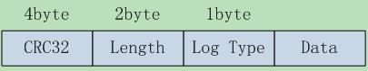
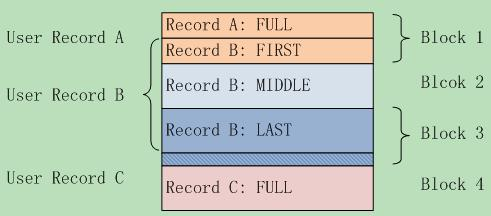

# Log_format

> 参考：<https://github.com/zzh-wisdom/leveldb/blob/mylearn/doc/log_format.md>

日志文件的内容是一系列大小为32KB的块。唯一的例外是文件的尾部可能包含部分块（不完全等于32KB）。

## Log block

每个块由一系列记录组成：



```json
block := record* trailer?
record :=
  checksum: uint32     // crc32c of type and data[] ; little-endian
  length: uint16       // little-endian
  type: uint8          // One of FULL, FIRST, MIDDLE, LAST
  data: uint8[length]
```

说明：

- 记录永远不会在块的最后六个字节内开始（因为它不合适，装不下完整一条记录）。此时块所有剩余字节构成`trailer`，且全部字节置为零，读者必须跳过。
- 如果当前块中刚好剩下7个字节，并且一个长度非零的记录被添加进来，则写入器必须发出FIRST记录（它不包含用户data字节），以填充块的末尾7个字节，然后在后续块中发出所有用户data。

```cpp
static const int kBlockSize = 32768;
// Header is checksum (4 bytes), length (2 bytes), type (1 byte).
static const int kHeaderSize = 4 + 2 + 1;
```

## Log type

将来可能会添加更多的日志类型，一些Reader可能会跳过它们不识别的记录，其他Reader可能会报告一些数据已经被跳过。

```json
FULL == 1
FIRST == 2
MIDDLE == 3
LAST == 4
```

- FULL：包含用户记录的完整内容
- FIRST, MIDDLE, LAST：用于表示用户的记录被分裂成多个碎片（典型的原因是因为block边界）
  - FIRST：用户记录的第一个分片
  - MIDDLE：用户记录的所有中间分片
  - LAST：用户记录的最后一个分片

例子：考虑如下的一系列用户记录

```text
A: length 1000
B: length 97270
C: length 8000
```

**A** 将在第一个block中存储为FULL类型的记录。

**B** 将被分裂三个分片：第一个分片占满第一个block的所有剩余空间，第二个分片占满完整的第二个block，第三个分片占第三个block的前面一部分。然后会剩余6个空闲的字节在第三分block的末尾，它将被0填充。

**C** 将在第4个block中存储为FULL类型的记录。



## 这样设计的好处（相比recordio）

1. 我们不需要任何启发式方法即可重新同步-只需转到下一个块边界并进行扫描即可。如果存在损坏，请跳至下一个块。作为附带好处，当一个日志文件的部分内容作为记录嵌入到另一个日志文件中时，我们不会感到困惑。
2. 在近似边界处进行分割（例如，针对mapreduce）非常简单：找到下一个块边界并跳过记录，直到我们找到FULL或FIRST记录。
3. 对于大型记录，我们不需要额外的缓冲。

## 缺点

1. 没有打包**小记录**。可以通过添加新的记录类型来解决此问题，因此这是当前实现的缺点，不一定是格式。

2. **无压缩**。同样，可以通过添加新的记录类型来解决此问题。

