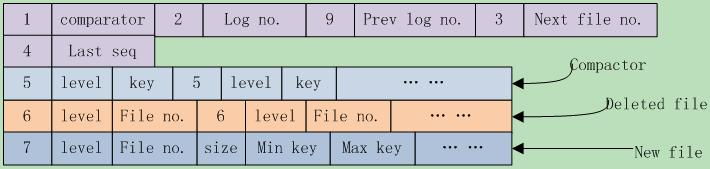

# 版本控制

> 参考: <https://blog.csdn.net/sparkliang/article/details/8776583>

- 执行一次compaction后，Leveldb将在当前版本基础上创建一个新版本
- 如果创建了一个Iterator，那么该Iterator所依附的版本将不会被leveldb删除。
- Version就代表了一个版本，它包括当前磁盘及内存中的所有文件信息。在所有的version中，只有一个是CURRENT。

VersionSet是所有Version的集合，这是个version的管理机构。

VersionEdit记录了Version之间的变化，相当于delta增量，表示又增加了多少文件，删除了文件。也就是说：Version0 + VersionEdit --> Version1。

每次文件有变动时，leveldb就把变动记录到一个VersionEdit变量中，然后通过VersionEdit把变动应用到current version上，并把current version的快照，也就是db元信息保存到MANIFEST文件中。

另外，MANIFEST文件组织是以VersionEdit的形式写入的，它本身是一个**log文件格式**，采用log::Writer/Reader的方式读写，一个VersionEdit就是一条log record。

## Manifest文件格式

Manifest文件记录了leveldb的管理元信息，主要包含以下内容：

- comparator名
- log文件编号
- 前一个log文件编号
- 下一个文件编号
- 上一个序列号seq
- 这些都是日志
- compact点，可能有多个，格式为{kCompactPointer, level, internal key}
- 删除文件，可能有多个，格式为{kDeletedFile, level, file number}
- 新文件，可能有多个，格式为{kNewFile, level, file number, file size, min key, max key}
  对于版本间变动它是新加的文件集合，对于MANIFEST快照是该版本包含的所有sstable文件集合。

Leveldb在写入每个字段之前，都会先写入一个varint型数字的**tag**来标记后面的字段类型。在读取时，先读取此字段，根据类型解析后面的信息。一共有9种类型：

```cpp
enum Tag {
  kComparator = 1,
  kLogNumber = 2,
  kNextFileNumber = 3,
  kLastSequence = 4,
  kCompactPointer = 5,
  kDeletedFile = 6,
  kNewFile = 7,
  // 8 was used for large value refs
  kPrevLogNumber = 9
};
```

一张图展示一下：



> 其中的数字都是varint存储格式，string都是以varint指明其长度，后面跟实际的字符串内容。

